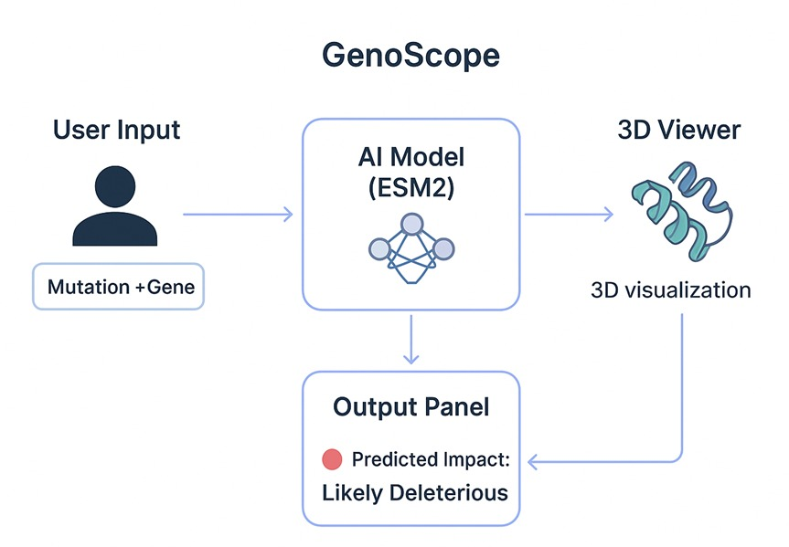

# 🧬 GenoScope Pro

**GenoScope Pro** is an AI-powered bioinformatics dashboard that predicts the pathogenicity of protein missense mutations **in real-time**. Combining **Meta AI’s ESM2 transformer**, **AlphaFold 3D structures**, and **ClinVar clinical evidence** to assess mutation impact instantly.


### 💫 UI


### ⚡️ Flow
<p align="center">
  
</p>
---

## 🏆 Award
GenoScope Pro won the **“Spark of Innovation” 🏆** at the **BioSpark Hackathon 2025**, held at *D Y Patil International University*.


## 🚀 Features

### 🤖 Zero-Shot AI Prediction
- Powered by **Meta’s ESM2 (`esm2_t6_8M_UR50D`)** model.
- Computes mutation pathogenicity using **evolutionary log-likelihood**.
- Requires **no labeled training data**.

### 🧩 Structural Visualization with AlphaFold
- Fetches **PDB models** directly from the AlphaFold DB.
- Uses **Py3Dmol** for 3D interactive rendering.
- Highlights mutation site in **red** for clarity.

### 🏥 Clinical Evidence Integration
- Queries **ClinVar** via **MyVariant.info**.
- Implements robust **fuzzy matching** to handle naming inconsistencies.
- Displays known pathogenicity classifications (Benign, Pathogenic, etc.)

---

## 🛠️ Tech Stack

| Component | Technology |
|----------|------------|
| **Frontend** | Streamlit |
| **AI Engine** | PyTorch + Hugging Face Transformers |
| **Model** | Meta AI ESM2 (`facebook/esm2_t6_8M_UR50D`) |
| **Bioinformatics** | BioPython, Py3Dmol |
| **APIs** | UniProt, AlphaFold DB, MyVariant.info |
| **Language** | Python 3.13 |

---

## 📦 Installation

### 1. Clone the repository
```bash
git clone https://github.com/Sparshr04/GenoScope-Pro.git
cd genoscope-pro
```
### 2. Environment Setup
> **Note:** This project supports **uv**, a new fast Python package manager.  
> If you don’t have uv:
> pip install uv

#### A.  Using uv 🚀
```bash
#If you use uv, you can install and run the app instantly:
uv venv
source .venv/bin/activate   # Windows: .venv\Scripts\activate
# installs dependencies from pyproject.toml
uv sync  

#Run the app
uv run streamlit run app.py
```

#### B.  Classic pip + venv 🚀
```bash
python -m venv venv
source venv/bin/activate     # Windows: venv\Scripts\activate
pip install -r requirements.txt

#Run the app
streamlit run app.py
```

### 📂 Project Structure
```
genoscope-pro/
├── app.py             # Streamlit Interface
├── assets
│   ├── demo3.gif
│   └── flow.jpeg
├── config.py          # Configuration and constants
├── core
│   ├── ai_engine.py.  # ESM2 Zero-shot Inference Logic
│   └── data_client.py # Handles UniProt, AlphaFold, ClinVar APIs
├── dataset.py
├── examples
│   └── mutations_list.txt
├── requirements.txt   # Dependencies
├── pyproject.toml
├── README.md
├── ui
│   └── visualizer.py  # 3D Py3Dmol Visualization

```


> ### ⚠️ Testing 
>If you are unsure about the UniProt IDs and Mutation Pairs. You can use the examples pairs. But all pairs might not work, although you can cross match the mutations and proteins! Just copy-paste the content from `examples/mutations_list.txt` file
